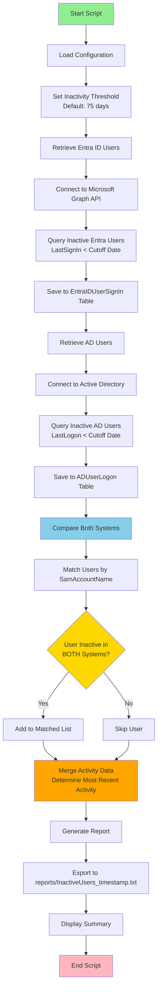

# identity-Lifecycle-Cleanup


## Description

PowerShell automation to identify and manage inactive accounts across **Entra ID** and **Active Directory**. Tracks users with no sign-in activity for 75 days (configurable), syncs data to SQL Server for auditing, and generates reports for users inactive in **both systems simultaneously**.

### Key Features
-  **Dual-System User Tracking** - Monitors user sign-in activity from both Entra ID and Active Directory
-  **Cross-Platform Comparison** - Identifies users inactive in both systems simultaneously
-  **SQL Database Integration** - Stores historical data for auditing and compliance
-  **Configurable Thresholds** - Customizable inactivity period (default: 75 days for both systems)
-  **Detailed Reporting** - Generates comprehensive reports with activity data from both sources
-  **IAM Compliance** - Helps maintain security by managing dormant accounts

## Database Structure

The solution uses two main tables to store user activity data:

```sql
-- ADUserLogon: Stores information from Active Directory
CREATE TABLE ADUserLogon (
    Id INT PRIMARY KEY IDENTITY(1,1),
    SamAccountName VARCHAR(100) NOT NULL,
    Name VARCHAR(200) NOT NULL,
    Status VARCHAR(500),
    LastLogon DATETIME,
    Days INT,
    Mail VARCHAR(100),
    MailManager VARCHAR(100),    -- Reserved for future use
    Relance1 BIT,                -- Reserved for future use
    Relance2 BIT                 -- Reserved for future use
)

-- EntraIDUserSignIn: Stores information from Microsoft Entra ID
CREATE TABLE EntraIDUserSignIn (
    Id INT PRIMARY KEY IDENTITY(1,1),
    DisplayName NVARCHAR(255),
    UserPrincipalName NVARCHAR(255),
    LastSignIn DATETIME
)
```

**Note**: The columns `MailManager`, `Relance1`, and `Relance2` in the `ADUserLogon` table are currently reserved for future reminder functionality but not yet implemented.


## Process Flow

The `Invoke-InactiveUserScan.ps1` script follows this workflow:



### Key Process Details

1. **Dual Retrieval**: The script independently queries both Entra ID and Active Directory for inactive users
2. **Database Storage**: Each source is saved to its respective SQL table for historical tracking
3. **Cross-System Matching**: Users are matched between systems using `SamAccountName` (extracted from UPN for Entra ID)
4. **Activity Merging**: When a user exists in both systems, the most recent activity date is selected
5. **Report Generation**: Only users inactive in **both systems** are included in the final report

## License

This project is licensed under the **GNU General Public License v3.0 (GPL-3.0)**.

You are free to use, modify, and distribute this software under the terms of the GPL-3.0 license. See the [LICENSE](LICENSE) file for full details.

### Key Points:
-  Free to use and modify
-  Must disclose source code
-  Must include original license and copyright notice
-  Changes must be documented
-  No warranty provided

## Requirements

- PowerShell 5.1 or higher
- Microsoft Graph PowerShell SDK (`Microsoft.Graph.Authentication`)
- Active Directory PowerShell Module (`ActiveDirectory`)
- SQL Server (with appropriate credentials)
- Appropriate permissions:
  - **Entra ID**: `User.Read.All`, `AuditLog.Read.All` (via App Registration with Client Secret)
  - **Active Directory**: Read access to user objects and `LastLogonDate` property
  - **SQL Server**: Write access to target database (CREATE, INSERT, TRUNCATE permissions)

## Installation & Usage

### 1. Initial Setup

First, initialize the database structure:

```powershell
.\scripts\INIT_DATABASE.ps1
```

This creates the required SQL database and tables (`ADUserLogon` and `EntraIDUserSignIn`).

### 2. Configuration

Create a `.env` file in the `config` directory with your credentials:

```env
# Entra ID Configuration
TENANT_ID=your-tenant-id
CLIENT_ID=your-client-id
CLIENT_SECRET=your-client-secret

# Active Directory Configuration
AD_SERVER=dc.yourdomain.com
AD_USERNAME=DOMAIN\admin
AD_PASSWORD=your-password

# SQL Server Configuration
SQL_SERVER=sql-server.yourdomain.com
SQL_DATABASE=InactiveUsersDB
SQL_USERNAME=sql-user
SQL_PASSWORD=sql-password

# Inactivity Threshold (optional, default: 75)
INACTIVE_DAYS_THRESHOLD=75
```

### 3. Run the Scan

Execute the main script to scan for inactive users:

```powershell
# Standard scan (both Entra ID and AD)
.\Invoke-InactiveUserScan.ps1

# Custom inactivity threshold (90 days)
.\Invoke-InactiveUserScan.ps1 -InactiveDays 90

# Skip Entra ID scan
.\Invoke-InactiveUserScan.ps1 -SkipEntraId

# Skip Active Directory scan
.\Invoke-InactiveUserScan.ps1 -SkipAD

# Verbose output for troubleshooting
.\Invoke-InactiveUserScan.ps1 -Verbose
```

### 4. Review Results

The script generates:
- Console output with scan summary
- A detailed report in `reports/InactiveUsers_YYYYMMDD_HHMMSS.txt`
- Database entries in both `ADUserLogon` and `EntraIDUserSignIn` tables

The report includes only users who are inactive in **both systems**, with details about:
- Last activity date from both sources
- Days since last activity
- User account status (enabled/disabled)
- Email and manager information

---

**Maintained by**: Ariovis-fr  
**Repository**: [EntraID Inactive User Cleanup Automation](https://github.com/Ariovis-fr/Entra-ID-Inactive-User-Cleanup-Automation)
