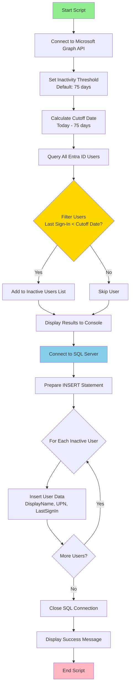

# Identity Lifecycle Cleanup


## Description

PowerShell automation to identify and manage inactive accounts in **Entra ID**, **Active Directory**, work with **Netwrix  Identity Manager (Usercube)**. Tracks users with no sign-in activity for 75-90 days and syncs data to SQL Server for auditing, reporting, and automated cleanup workflows.

### Key Features
- 🔍 **Automated User Tracking** - Monitors user sign-in activity from Entra ID, Active Directory, and Netwrix Identity Manager (NIM)
- 📊 **SQL Database Integration** - Stores historical data for auditing and compliance
- ⏰ **Configurable Thresholds** - Customizable inactivity periods (default: 75 days for Entra ID, 90 days for AD)
- 📧 **Reminder System** - Tracks multiple reminder notifications (Relance1, Relance2)
- 🔐 **IAM Compliance** - Helps maintain security by managing dormant accounts
- 🔧 **Multi-Platform Support** - Works with both native AD/Entra ID and Netwrix Identity Manager environments

## Database Structure

The solution uses two main tables to store user activity data:

```mermaiderDiagram
    ADUserLogon {
        INT Id PK "Primary Key (Identity)"
        VARCHAR(100) SamAccountName "User account name"
        VARCHAR(200) Name "Full name"
        VARCHAR(500) Status "Account status"
        DATETIME LastLogon "Last logon timestamp"
        INT Days "Days since last logon"
        VARCHAR(100) Mail "User email"
        VARCHAR(100) MailManager "Manager email"
        BIT Relance1 "First reminder sent"
        BIT Relance2 "Second reminder sent"
    }
    
    EntraIDUserSignIn {
        INT Id PK "Primary Key (Identity)"
        NVARCHAR(255) DisplayName "User display name"
        NVARCHAR(255) UserPrincipalName "UPN"
        DATETIME LastSignIn "Last sign-in timestamp"
    }
```

**ADUserLogon**: Stores information from Domain Controllers (Active Directory)  
**EntraIDUserSignIn**: Stores information from Microsoft Entra ID (Azure AD)


## EntraToSQL Process Flow

The `EntraToSQL.ps1` script follows this workflow:



## License

This project is licensed under the **GNU General Public License v3.0 (GPL-3.0)**.

You are free to use, modify, and distribute this software under the terms of the GPL-3.0 license. See the [LICENSE](LICENSE) file for full details.

### Key Points:
- ✅ Free to use and modify
- ✅ Must disclose source code
- ✅ Must include original license and copyright notice
- ✅ Changes must be documented
- ❌ No warranty provided

## Requirements

- PowerShell 5.1 or higher
- Microsoft Graph PowerShell SDK
- SQL Server (with appropriate credentials)
- Active Directory PowerShell Module (for AD integration)
- Netwrix Identity Manager (NIM) - Optional, for NIM-based environments
- Appropriate permissions:
  - Entra ID: `User.Read.All`, `AuditLog.Read.All`
  - Active Directory: Read access to user objects
  - Netwrix NIM: API access or PowerShell module integration
  - SQL Server: Write access to target database

---

**Maintained by**: Ariovis-fr  

**Repository**: [EntraID Inactive User Cleanup Automation](https://github.com/Ariovis-fr/Entra-ID-Inactive-User-Cleanup-Automation)
